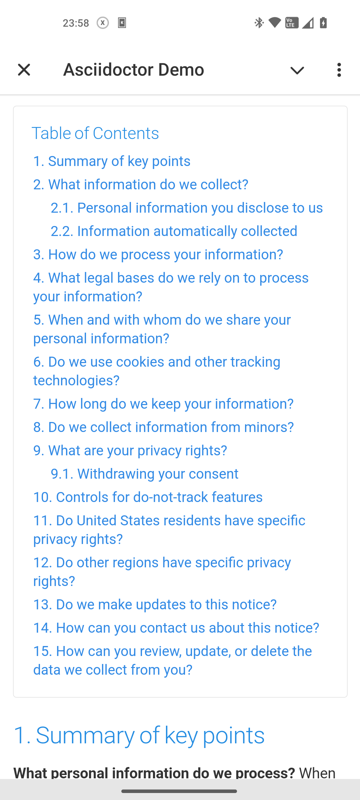

= Asciidoctor Default Stylesheet for Telegram Mini Apps

This is the https://github.com/asciidoctor/asciidoctor/tree/main/src/stylesheets[Asciidoctor's Default Stylesheet] adapted for use in Telegram Mini Apps.
This stylesheet respects Mini Apps' https://core.telegram.org/bots/webapps#themeparams[theme params], it means that it will adapt to the user's theme.

== Demo

